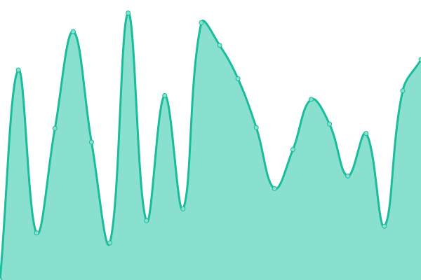

# [📈 Live Status](https://demo.upptime.js.org): <!--live status--> **🟧 Partial outage**

This repository contains the open-source uptime monitor and status page for [Pawel Stefanski](https://demo.upptime.js.org), powered by [Upptime](https://github.com/upptime/upptime).

With [Upptime](https://upptime.js.org), you can get your own unlimited and free uptime monitor and status page, powered entirely by a GitHub repository. We use [Issues](https://github.com/pejotes/upptime/issues) as incident reports, [Actions](https://github.com/pejotes/upptime/actions) as uptime monitors, and [Pages](https://demo.upptime.js.org) for the status page.

<!--start: status pages-->
<!-- This summary is generated by Upptime (https://github.com/upptime/upptime) -->
<!-- Do not edit this manually, your changes will be overwritten -->
<!-- prettier-ignore -->
| URL | Status | History | Response Time | Uptime |
| --- | ------ | ------- | ------------- | ------ |
|  [Fotoamigo](https://www.fotoamigo.pl) | 🟩 Up | [fotoamigo.yml](https://github.com/pejotes/upptime/commits/HEAD/history/fotoamigo.yml) | 

 2265ms
     
 | 

<a href="https://pejotes.github.io/upptime/history/fotoamigo">99.24%</a>
    

|  [Beyond.pl](http://www.beyond.pl) | 🟥 Down | [beyond-pl.yml](https://github.com/pejotes/upptime/commits/HEAD/history/beyond-pl.yml) | 

 889ms
     
 | 

<a href="https://pejotes.github.io/upptime/history/beyond-pl">98.02%</a>
    

|  [cleura.cloud](https://cleura.cloud) | 🟩 Up | [cleura-cloud.yml](https://github.com/pejotes/upptime/commits/HEAD/history/cleura-cloud.yml) | 

 989ms
     
 | 

<a href="https://pejotes.github.io/upptime/history/cleura-cloud">100.00%</a>
    

|  [OBJ BUF1](https://swift-buf1.citycloud.com:8080/) | 🟩 Up | [obj-buf-1.yml](https://github.com/pejotes/upptime/commits/HEAD/history/obj-buf-1.yml) | 

 558ms
     
 | 

<a href="https://pejotes.github.io/upptime/history/obj-buf-1">100.00%</a>
    

|  [OBJ KNA1](https://swift-kna1.citycloud.com:8080/) | 🟩 Up | [obj-kna-1.yml](https://github.com/pejotes/upptime/commits/HEAD/history/obj-kna-1.yml) | 

 734ms
     
 | 

<a href="https://pejotes.github.io/upptime/history/obj-kna-1">100.00%</a>
    

|  [OBJ FRA1](https://swift-fra1.citycloud.com:8080/) | 🟩 Up | [obj-fra-1.yml](https://github.com/pejotes/upptime/commits/HEAD/history/obj-fra-1.yml) | 

 824ms
     
 | 

<a href="https://pejotes.github.io/upptime/history/obj-fra-1">100.00%</a>
    

<!--end: status pages-->

[**Visit our status website →**](https://demo.upptime.js.org)

## 📄 License

- Powered by: [Upptime](https://github.com/upptime/upptime)
- Code: [MIT](./LICENSE) © [Pawel Stefanski](https://demo.upptime.js.org)
- Data in the `./history` directory: [Open Database License](https://opendatacommons.org/licenses/odbl/1-0/)
